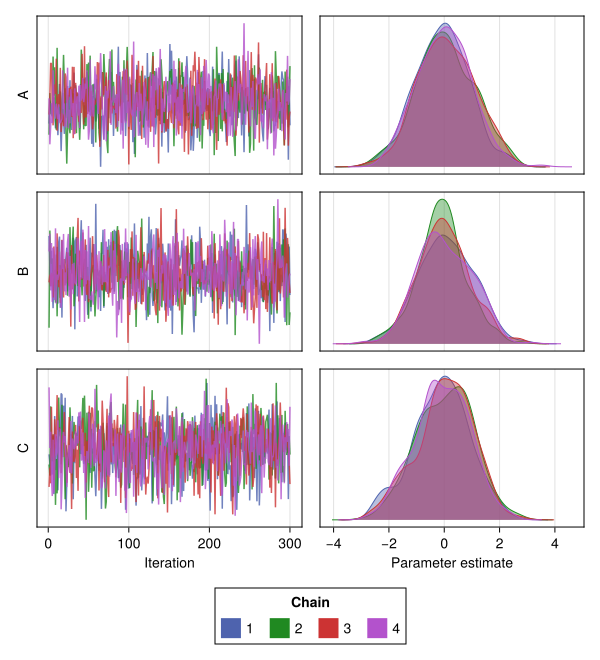

# ChainsMakie

[](https://github.com/simonsteiger/ChainsMakie.jl/actions/workflows/CI.yml?query=branch%3Amain)
[](https://simonsteiger.github.io/ChainsMakie.jl/dev/)

A package to plot MCMC Chains using Makie.jl

> [!WARNING]  
> This package is not yet registered. If you want to try it you will have to install it via `Pkg.add(url="https://github.com/simonsteiger/ChainsMakie.jl")`.

## Example



```julia
using ChainsMakie, CairoMakie
import MCMCChains: Chains

chains = Chains(randn(300, 3, 4), [:A, :B, :C])

julia_quartet = [colorant"#4e63ae", colorant"#208921", colorant"#cc3333", colorant"#b352cc"]
plot(chains; color = julia_quartet, link_x = true)
```

## Features

ChainsMakie contains recipes for the following `Chains`-specific plotting functions:

- `autocorplot`
- `forestplot`
- `meanplot`
- `ridgeline`
- `traceplot`
- `trankplot`

In addition, it extends the following existing Makie functions by adding a method for `Chains`:

- `density`
- `hist`
- `plot`
- `violin`
